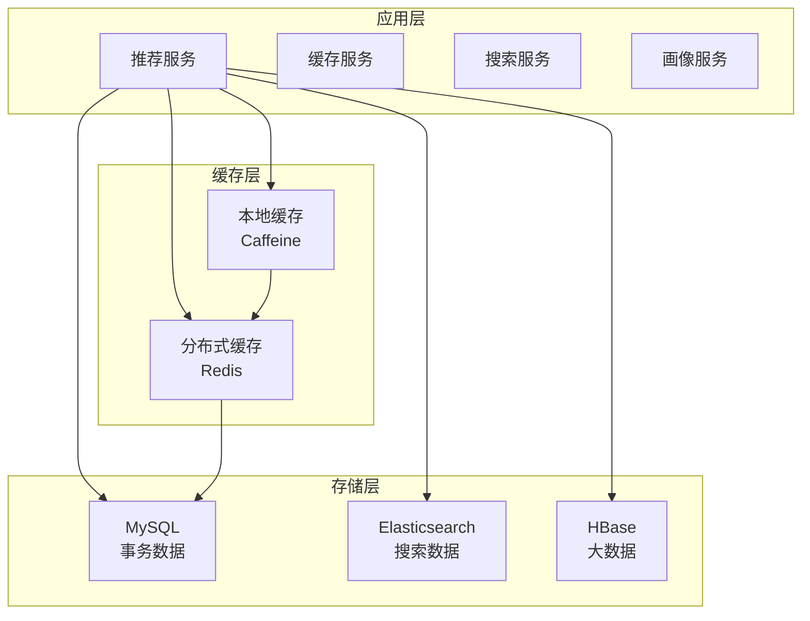

# 主播推荐系统技术深度实现文档

## 1. 各组件交互架构详解

### 1.1 数据存储组件交互

#### MySQL + Redis + Elasticsearch + HBase 多存储协同



#### 1.1.1 MySQL：核心业务数据存储

**数据类型**：
- 用户基础信息 (user 表)
- 主播基础信息 (streamer 表)
- 订单交易数据 (order 表)
- 系统配置数据 (config 表)

**交互模式**：
```java
// 读取策略：缓存优先
@Service
public class UserService {
    
    public User getUserById(Long userId) {
        // 1. 检查本地缓存 (Caffeine)
        User user = localCache.get("user:" + userId);
        if (user != null) return user;
        
        // 2. 检查Redis缓存
        user = redisTemplate.opsForValue().get("user:" + userId);
        if (user != null) {
            localCache.put("user:" + userId, user);
            return user;
        }
        
        // 3. 查询MySQL
        user = userMapper.selectById(userId);
        if (user != null) {
            // 写入缓存
            redisTemplate.opsForValue().set("user:" + userId, user, 1, TimeUnit.HOURS);
            localCache.put("user:" + userId, user);
        }
        return user;
    }
}
```

#### 1.1.2 Redis：多级缓存核心

**缓存分层设计**：
```yaml
缓存层级:
  L1-JVM缓存:
    - 配置数据: 永久缓存
    - 热点用户: 5分钟
    - 计算结果: 10分钟
    
  L2-Redis缓存:
    - 用户画像: 1小时
    - 推荐结果: 30分钟
    - 会话数据: 2小时
    - 计数器: 24小时
    
  缓存更新策略:
    - 写操作: Cache-Aside 模式
    - 失效策略: TTL + 事件驱动
    - 预热策略: 定时任务 + 懒加载
```

**Redis数据结构使用**：
```java
@Component
public class RecommendCacheManager {
    
    // 字符串：简单KV缓存
    public void cacheUserProfile(Long userId, UserProfile profile) {
        redisTemplate.opsForValue().set(
            "user:profile:" + userId, 
            JSON.toJSONString(profile), 
            1, TimeUnit.HOURS
        );
    }
    
    // 哈希：用户偏好数据
    public void cacheUserPreferences(Long userId, Map<String, Object> prefs) {
        redisTemplate.opsForHash().putAll("user:prefs:" + userId, prefs);
        redisTemplate.expire("user:prefs:" + userId, 2, TimeUnit.HOURS);
    }
    
    // 有序集合：排行榜数据
    public void cacheHotStreamers(List<Streamer> streamers) {
        String key = "hot:streamers";
        streamers.forEach(streamer -> {
            redisTemplate.opsForZSet().add(key, streamer.getId().toString(), streamer.getHotScore());
        });
        redisTemplate.expire(key, 10, TimeUnit.MINUTES);
    }
    
    // 列表：推荐结果
    public void cacheRecommendResult(Long userId, List<Long> streamerIds) {
        String key = "recommend:result:" + userId;
        redisTemplate.opsForList().rightPushAll(key, streamerIds.toArray());
        redisTemplate.expire(key, 30, TimeUnit.MINUTES);
    }
    
    // 位图：用户行为标记
    public void markUserBehavior(Long userId, String action) {
        String key = "user:behavior:" + LocalDate.now().toString();
        redisTemplate.opsForValue().setBit(key, userId, true);
        redisTemplate.expire(key, 7, TimeUnit.DAYS);
    }
}
```

#### 1.1.3 Elasticsearch：搜索和实时分析

**索引设计**：
```json
{
  "mappings": {
    "properties": {
      "streamerId": {"type": "long"},
      "nickname": {
        "type": "text",
        "analyzer": "ik_max_word",
        "search_analyzer": "ik_smart"
      },
      "tags": {
        "type": "nested",
        "properties": {
          "name": {"type": "keyword"},
          "weight": {"type": "float"}
        }
      },
      "location": {"type": "geo_point"},
      "rating": {"type": "float"},
      "categories": {"type": "keyword"},
      "onlineStatus": {"type": "boolean"},
      "hotScore": {"type": "float"},
      "createTime": {"type": "date"}
    }
  }
}
```

**实时搜索服务**：
```java
@Service
public class StreamerSearchService {
    
    @Autowired
    private ElasticsearchRestTemplate elasticsearchTemplate;
    
    public List<Streamer> searchStreamers(SearchRequest request) {
        // 构建复合查询
        BoolQueryBuilder boolQuery = QueryBuilders.boolQuery();
        
        // 文本搜索
        if (StringUtils.isNotEmpty(request.getKeyword())) {
            boolQuery.must(QueryBuilders.multiMatchQuery(request.getKeyword())
                .field("nickname", 2.0f)  // 昵称权重更高
                .field("introduction", 1.0f)
                .analyzer("ik_smart"));
        }
        
        // 地理位置过滤
        if (request.getLocation() != null) {
            boolQuery.filter(QueryBuilders.geoDistanceQuery("location")
                .point(request.getLocation().getLat(), request.getLocation().getLon())
                .distance(request.getRadius(), DistanceUnit.KILOMETERS));
        }
        
        // 标签过滤
        if (!CollectionUtils.isEmpty(request.getTags())) {
            boolQuery.filter(QueryBuilders.nestedQuery("tags",
                QueryBuilders.termsQuery("tags.name", request.getTags()),
                ScoreMode.Avg));
        }
        
        // 在线状态过滤
        if (request.getOnlineOnly()) {
            boolQuery.filter(QueryBuilders.termQuery("onlineStatus", true));
        }
        
        // 评分范围过滤
        if (request.getMinRating() != null) {
            boolQuery.filter(QueryBuilders.rangeQuery("rating").gte(request.getMinRating()));
        }
        
        // 排序：相关性 + 热度 + 评分
        NativeSearchQuery searchQuery = new NativeSearchQueryBuilder()
            .withQuery(boolQuery)
            .withSort(SortBuilders.scoreSort().order(SortOrder.DESC))
            .withSort(SortBuilders.fieldSort("hotScore").order(SortOrder.DESC))
            .withSort(SortBuilders.fieldSort("rating").order(SortOrder.DESC))
            .withPageable(PageRequest.of(request.getPage(), request.getSize()))
            .build();
        
        SearchHits<StreamerDocument> searchHits = elasticsearchTemplate.search(searchQuery, StreamerDocument.class);
        
        return searchHits.stream()
            .map(hit -> convertToStreamer(hit.getContent()))
            .collect(Collectors.toList());
    }
}
```

#### 1.1.4 HBase：大数据存储

**表设计**：
```java
// 用户行为宽表
Table: user_behavior
RowKey: userId_timestamp
ColumnFamily: 
  - basic: action, streamerId, duration, timestamp
  - context: device, location, ip, userAgent
  - metrics: score, weight, preference_delta

// 相似度矩阵表
Table: similarity_matrix  
RowKey: userId1_userId2 (字典序)
ColumnFamily:
  - sim: collaborative_sim, content_sim, hybrid_sim
  - meta: last_updated, confidence, sample_size

// 实时特征表
Table: realtime_features
RowKey: userId_date
ColumnFamily:
  - stats: click_count, view_time, order_count
  - prefs: category_weights, tag_weights, price_range
```

**HBase访问层**：
```java
@Repository
public class UserBehaviorHBaseRepository {
    
    @Autowired
    private HbaseTemplate hbaseTemplate;
    
    public void saveUserBehavior(UserBehavior behavior) {
        String rowKey = behavior.getUserId() + "_" + System.currentTimeMillis();
        
        hbaseTemplate.put("user_behavior", rowKey, "basic", "action", behavior.getAction());
        hbaseTemplate.put("user_behavior", rowKey, "basic", "streamerId", behavior.getStreamerId().toString());
        hbaseTemplate.put("user_behavior", rowKey, "basic", "duration", behavior.getDuration().toString());
        hbaseTemplate.put("user_behavior", rowKey, "context", "device", behavior.getDevice());
        hbaseTemplate.put("user_behavior", rowKey, "context", "location", behavior.getLocation());
    }
    
    public List<UserBehavior> getUserBehaviors(Long userId, Date startTime, Date endTime) {
        String startRow = userId + "_" + startTime.getTime();
        String endRow = userId + "_" + endTime.getTime();
        
        Scan scan = new Scan();
        scan.setStartRow(Bytes.toBytes(startRow));
        scan.setStopRow(Bytes.toBytes(endRow));
        
        return hbaseTemplate.find("user_behavior", scan, (result, rowNum) -> {
            UserBehavior behavior = new UserBehavior();
            behavior.setUserId(userId);
            behavior.setAction(Bytes.toString(result.getValue(Bytes.toBytes("basic"), Bytes.toBytes("action"))));
            behavior.setStreamerId(Long.valueOf(Bytes.toString(result.getValue(Bytes.toBytes("basic"), Bytes.toBytes("streamerId")))));
            return behavior;
        });
    }
}
```

### 1.2 组件协同工作流程

```java
@Service
public class RecommendOrchestrator {
    
    public List<Streamer> getRecommendations(Long userId) {
        // 1. 获取用户画像 (MySQL + Redis)
        UserProfile profile = getUserProfile(userId);
        
        // 2. 实时行为分析 (HBase + Redis)
        RealtimeFeatures features = getRealtimeFeatures(userId);
        
        // 3. 候选集召回 (多数据源)
        List<Long> candidates = recallCandidates(userId, profile, features);
        
        // 4. 特征丰富 (MySQL + ES)
        List<StreamerWithFeatures> enriched = enrichFeatures(candidates);
        
        // 5. 算法排序
        List<Streamer> ranked = rankingService.rank(enriched, profile, features);
        
        // 6. 结果缓存 (Redis)
        cacheResults(userId, ranked);
        
        return ranked;
    }
    
    private List<Long> recallCandidates(Long userId, UserProfile profile, RealtimeFeatures features) {
        List<Long> candidates = new ArrayList<>();
        
        // 热门召回 (Redis ZSet)
        candidates.addAll(getHotStreamers(20));
        
        // 协同过滤召回 (HBase 相似度矩阵)
        candidates.addAll(getCollaborativeFilterCandidates(userId, 50));
        
        // 内容召回 (Elasticsearch)
        candidates.addAll(getContentBasedCandidates(profile.getPreferences(), 30));
        
        // 新颖性召回 (MySQL + 时间过滤)
        candidates.addAll(getNoveltyStreamers(userId, 10));
        
        return candidates.stream().distinct().collect(Collectors.toList());
    }
}
```

## 2. 画像生成与动态调整机制

### 2.1 用户画像生成流程

#### 2.1.1 静态画像构建

```java
@Service
public class UserProfileGenerator {
    
    @Scheduled(fixedRate = 3600000) // 每小时执行
    public void generateUserProfiles() {
        List<Long> activeUsers = getActiveUsers();
        
        activeUsers.parallelStream().forEach(userId -> {
            try {
                UserProfile profile = buildUserProfile(userId);
                saveUserProfile(userId, profile);
            } catch (Exception e) {
                log.error("Failed to generate profile for user: {}", userId, e);
            }
        });
    }
    
    private UserProfile buildUserProfile(Long userId) {
        UserProfile profile = new UserProfile();
        profile.setUserId(userId);
        
        // 基础信息
        User user = userService.getUserById(userId);
        profile.setAge(user.getAge());
        profile.setGender(user.getGender());
        profile.setRegion(user.getRegion());
        
        // 行为特征分析
        List<UserBehavior> behaviors = getBehaviorHistory(userId, 30); // 30天
        profile.setActivityLevel(calculateActivityLevel(behaviors));
        profile.setPreferredTime(calculatePreferredTime(behaviors));
        profile.setAvgSessionDuration(calculateAvgSessionDuration(behaviors));
        
        // 偏好分析
        Map<String, Double> categoryPrefs = calculateCategoryPreferences(behaviors);
        Map<String, Double> tagPrefs = calculateTagPreferences(behaviors);
        profile.setCategoryPreferences(categoryPrefs);
        profile.setTagPreferences(tagPrefs);
        
        // 消费能力分析
        List<Order> orders = getOrderHistory(userId, 90); // 90天
        profile.setAvgOrderAmount(calculateAvgOrderAmount(orders));
        profile.setOrderFrequency(calculateOrderFrequency(orders));
        profile.setPricePreference(calculatePricePreference(orders));
        
        // 社交特征
        profile.setFollowCount(getFollowCount(userId));
        profile.setInteractionScore(calculateInteractionScore(userId));
        
        return profile;
    }
    
    private Map<String, Double> calculateCategoryPreferences(List<UserBehavior> behaviors) {
        Map<String, Integer> categoryCount = new HashMap<>();
        Map<String, Long> categoryDuration = new HashMap<>();
        
        behaviors.forEach(behavior -> {
            String category = getStreamerCategory(behavior.getStreamerId());
            categoryCount.merge(category, 1, Integer::sum);
            categoryDuration.merge(category, behavior.getDuration(), Long::sum);
        });
        
        // 综合点击次数和观看时长计算偏好
        Map<String, Double> preferences = new HashMap<>();
        categoryCount.forEach((category, count) -> {
            long duration = categoryDuration.getOrDefault(category, 0L);
            double score = 0.3 * count + 0.7 * (duration / 1000.0); // 时长权重更高
            preferences.put(category, score);
        });
        
        // 归一化
        double sum = preferences.values().stream().mapToDouble(Double::doubleValue).sum();
        preferences.replaceAll((k, v) -> v / sum);
        
        return preferences;
    }
}
```

#### 2.1.2 实时画像更新

```java
@Component
public class RealtimeProfileUpdater {
    
    @EventListener
    @Async
    public void onUserBehavior(UserBehaviorEvent event) {
        updateRealtimeProfile(event.getUserId(), event.getBehavior());
    }
    
    private void updateRealtimeProfile(Long userId, UserBehavior behavior) {
        String key = "realtime:profile:" + userId;
        
        // 更新实时统计
        redisTemplate.opsForHash().increment(key, "total_clicks", 1);
        redisTemplate.opsForHash().increment(key, "total_duration", behavior.getDuration());
        
        // 更新分类偏好
        String category = getStreamerCategory(behavior.getStreamerId());
        redisTemplate.opsForHash().increment(key, "category:" + category, 1);
        
        // 更新时间偏好
        int hour = LocalDateTime.now().getHour();
        redisTemplate.opsForHash().increment(key, "hour:" + hour, 1);
        
        // 设置过期时间
        redisTemplate.expire(key, 24, TimeUnit.HOURS);
        
        // 如果达到阈值，触发画像重新计算
        Long totalClicks = (Long) redisTemplate.opsForHash().get(key, "total_clicks");
        if (totalClicks % 10 == 0) { // 每10次行为触发一次
            triggerProfileUpdate(userId);
        }
    }
    
    @Async
    public void triggerProfileUpdate(Long userId) {
        try {
            // 异步更新用户画像
            UserProfile profile = userProfileGenerator.buildUserProfile(userId);
            userProfileService.updateUserProfile(userId, profile);
            
            // 清除相关缓存
            cacheManager.evict("userProfile", userId);
        } catch (Exception e) {
            log.error("Failed to update profile for user: {}", userId, e);
        }
    }
}
```

### 2.2 主播画像生成

#### 2.2.1 主播质量评分系统

```java
@Service
public class StreamerProfileGenerator {
    
    public StreamerProfile buildStreamerProfile(Long streamerId) {
        StreamerProfile profile = new StreamerProfile();
        profile.setStreamerId(streamerId);
        
        // 基础信息
        Streamer streamer = streamerService.getStreamerById(streamerId);
        profile.setLevel(streamer.getLevel());
        profile.setCategories(streamer.getCategories());
        profile.setTags(streamer.getTags());
        
        // 服务质量评分
        ServiceQualityScore qualityScore = calculateServiceQuality(streamerId);
        profile.setQualityScore(qualityScore);
        
        // 热度评分
        HotScore hotScore = calculateHotScore(streamerId);
        profile.setHotScore(hotScore);
        
        // 用户反馈分析
        FeedbackAnalysis feedback = analyzeFeedback(streamerId);
        profile.setFeedbackAnalysis(feedback);
        
        // 时间偏好分析
        TimePreference timePreference = analyzeTimePreference(streamerId);
        profile.setTimePreference(timePreference);
        
        return profile;
    }
    
    private ServiceQualityScore calculateServiceQuality(Long streamerId) {
        List<Order> orders = getOrderHistory(streamerId, 30);
        
        ServiceQualityScore score = new ServiceQualityScore();
        
        // 完成率
        long completedOrders = orders.stream().filter(Order::isCompleted).count();
        score.setCompletionRate((double) completedOrders / orders.size());
        
        // 平均评分
        double avgRating = orders.stream()
            .filter(order -> order.getRating() != null)
            .mapToDouble(Order::getRating)
            .average()
            .orElse(0.0);
        score.setAverageRating(avgRating);
        
        // 响应速度
        double avgResponseTime = orders.stream()
            .filter(order -> order.getResponseTime() != null)
            .mapToLong(Order::getResponseTime)
            .average()
            .orElse(0.0);
        score.setResponseSpeed(60000.0 / avgResponseTime); // 转换为每分钟响应次数
        
        // 重复下单率
        Set<Long> uniqueUsers = orders.stream().map(Order::getUserId).collect(Collectors.toSet());
        score.setReturnCustomerRate((double) (orders.size() - uniqueUsers.size()) / orders.size());
        
        // 综合质量分
        double overallScore = 0.3 * score.getCompletionRate() +
                             0.3 * (avgRating / 5.0) +
                             0.2 * Math.min(score.getResponseSpeed() / 10.0, 1.0) +
                             0.2 * score.getReturnCustomerRate();
        score.setOverallScore(overallScore);
        
        return score;
    }
    
    private HotScore calculateHotScore(Long streamerId) {
        HotScore hotScore = new HotScore();
        
        // 最近7天的活跃度
        List<UserBehavior> recentBehaviors = getStreamerBehaviors(streamerId, 7);
        
        // 点击热度
        long clickCount = recentBehaviors.stream()
            .filter(b -> "click".equals(b.getAction()))
            .count();
        hotScore.setClickHeat(clickCount);
        
        // 观看热度
        long totalViewTime = recentBehaviors.stream()
            .filter(b -> "view".equals(b.getAction()))
            .mapToLong(UserBehavior::getDuration)
            .sum();
        hotScore.setViewHeat(totalViewTime / 3600.0); // 转换为小时
        
        // 订单热度
        long orderCount = getOrderCount(streamerId, 7);
        hotScore.setOrderHeat(orderCount);
        
        // 分享热度
        long shareCount = recentBehaviors.stream()
            .filter(b -> "share".equals(b.getAction()))
            .count();
        hotScore.setShareHeat(shareCount);
        
        // 综合热度分
        double overallHeat = 0.2 * Math.log(clickCount + 1) +
                            0.4 * Math.log(totalViewTime / 60.0 + 1) +
                            0.3 * Math.log(orderCount + 1) +
                            0.1 * Math.log(shareCount + 1);
        hotScore.setOverallHeat(overallHeat);
        
        return hotScore;
    }
}
```

### 2.3 标签系统与权重计算

#### 2.3.1 标签权重动态调整

```java
@Service
public class TagWeightCalculator {
    
    @Scheduled(fixedRate = 1800000) // 每30分钟执行
    public void updateTagWeights() {
        List<Tag> allTags = tagService.getAllTags();
        
        allTags.parallelStream().forEach(tag -> {
            try {
                double newWeight = calculateTagWeight(tag);
                tag.setWeight(newWeight);
                tagService.updateTag(tag);
            } catch (Exception e) {
                log.error("Failed to update weight for tag: {}", tag.getId(), e);
            }
        });
    }
    
    private double calculateTagWeight(Tag tag) {
        // 1. 全局热度权重
        long globalUsage = getTagGlobalUsage(tag.getId(), 7); // 7天使用次数
        double globalWeight = Math.log(globalUsage + 1) / 10.0;
        
        // 2. 转化效果权重
        double conversionRate = getTagConversionRate(tag.getId(), 7);
        double conversionWeight = conversionRate * 2.0;
        
        // 3. 时效性权重
        double recentUsage = getTagRecentUsage(tag.getId(), 1); // 1天使用次数
        double freshnessWeight = recentUsage / Math.max(globalUsage / 7.0, 1.0);
        
        // 4. 质量权重（基于标签关联的主播质量）
        double qualityWeight = getTagQualityWeight(tag.getId());
        
        // 综合权重计算
        double finalWeight = 0.3 * globalWeight +
                            0.4 * conversionWeight +
                            0.2 * freshnessWeight +
                            0.1 * qualityWeight;
        
        // 归一化到0-1之间
        return Math.min(Math.max(finalWeight, 0.0), 1.0);
    }
    
    private double getTagConversionRate(Long tagId, int days) {
        // 获取包含该标签的主播
        List<Long> streamerIds = getStreamersByTag(tagId);
        
        long totalViews = 0;
        long totalOrders = 0;
        
        for (Long streamerId : streamerIds) {
            totalViews += getStreamerViews(streamerId, days);
            totalOrders += getStreamerOrders(streamerId, days);
        }
        
        return totalViews > 0 ? (double) totalOrders / totalViews : 0.0;
    }
}
```

#### 2.3.2 个性化标签推荐

```java
@Service
public class PersonalizedTagRecommender {
    
    public List<Tag> recommendTags(Long userId, int limit) {
        UserProfile profile = userProfileService.getUserProfile(userId);
        
        // 获取所有候选标签
        List<Tag> candidateTags = tagService.getActiveTags();
        
        // 计算个性化得分
        List<TagScore> tagScores = candidateTags.stream()
            .map(tag -> calculatePersonalizedScore(tag, profile))
            .sorted((a, b) -> Double.compare(b.getScore(), a.getScore()))
            .limit(limit)
            .collect(Collectors.toList());
        
        return tagScores.stream()
            .map(TagScore::getTag)
            .collect(Collectors.toList());
    }
    
    private TagScore calculatePersonalizedScore(Tag tag, UserProfile profile) {
        double score = 0.0;
        
        // 1. 历史偏好匹配
        Double historicalPreference = profile.getTagPreferences().get(tag.getName());
        if (historicalPreference != null) {
            score += 0.4 * historicalPreference;
        }
        
        // 2. 分类关联性
        for (String category : tag.getCategories()) {
            Double categoryPref = profile.getCategoryPreferences().get(category);
            if (categoryPref != null) {
                score += 0.3 * categoryPref;
            }
        }
        
        // 3. 标签全局权重
        score += 0.2 * tag.getWeight();
        
        // 4. 新颖性奖励
        boolean isNewToUser = !profile.getTagPreferences().containsKey(tag.getName());
        if (isNewToUser) {
            score += 0.1 * tag.getWeight(); // 新标签给予额外权重
        }
        
        return new TagScore(tag, score);
    }
}
```

## 3. 实时处理架构

### 3.1 流式数据处理架构

```java
// 使用Spring Cloud Stream + RocketMQ实现
@Component
public class UserBehaviorProcessor {
    
    @StreamListener("user-behavior-input")
    public void processUserBehavior(UserBehavior behavior) {
        // 1. 数据验证和清洗
        if (!isValidBehavior(behavior)) {
            log.warn("Invalid behavior data: {}", behavior);
            return;
        }
        
        // 2. 实时特征更新
        updateRealtimeFeatures(behavior);
        
        // 3. 触发实时推荐更新
        triggerRecommendationUpdate(behavior);
        
        // 4. 持久化到HBase
        saveToHBase(behavior);
        
        // 5. 发送到下游处理
        sendToDownstream(behavior);
    }
    
    private void updateRealtimeFeatures(UserBehavior behavior) {
        // 更新用户实时特征
        CompletableFuture.runAsync(() -> {
            realtimeProfileUpdater.updateProfile(behavior.getUserId(), behavior);
        });
        
        // 更新主播实时特征
        CompletableFuture.runAsync(() -> {
            streamerProfileUpdater.updateProfile(behavior.getStreamerId(), behavior);
        });
        
        // 更新全局统计
        CompletableFuture.runAsync(() -> {
            globalStatisticsUpdater.updateStatistics(behavior);
        });
    }
}
```

### 3.2 实时特征工程

#### 3.2.1 实时特征计算引擎

```java
@Service
public class RealtimeFeatureEngine {
    
    private final Map<String, FeatureCalculator> calculators = new HashMap<>();
    
    @PostConstruct
    public void initCalculators() {
        calculators.put("user_activity", new UserActivityCalculator());
        calculators.put("streamer_popularity", new StreamerPopularityCalculator());
        calculators.put("category_trend", new CategoryTrendCalculator());
        calculators.put("interaction_score", new InteractionScoreCalculator());
    }
    
    public void updateFeatures(UserBehavior behavior) {
        calculators.values().parallelStream().forEach(calculator -> {
            try {
                calculator.update(behavior);
            } catch (Exception e) {
                log.error("Feature calculation failed: {}", calculator.getClass().getSimpleName(), e);
            }
        });
    }
    
    // 用户活跃度计算器
    public static class UserActivityCalculator implements FeatureCalculator {
        @Autowired
        private RedisTemplate<String, Object> redisTemplate;
        
        @Override
        public void update(UserBehavior behavior) {
            Long userId = behavior.getUserId();
            String key = "feature:user_activity:" + userId;
            
            // 滑动窗口统计（最近1小时）
            long now = System.currentTimeMillis();
            
            // 添加当前行为
            redisTemplate.opsForZSet().add(key, now, now);
            
            // 移除1小时前的数据
            redisTemplate.opsForZSet().removeRangeByScore(key, 0, now - 3600000);
            
            // 计算活跃度得分
            Long activityCount = redisTemplate.opsForZSet().count(key, now - 3600000, now);
            double activityScore = Math.min(activityCount / 10.0, 1.0); // 归一化
            
            // 存储特征值
            redisTemplate.opsForValue().set(
                "feature:user_activity_score:" + userId,
                activityScore,
                1, TimeUnit.HOURS
            );
        }
    }
    
    // 主播人气计算器
    public static class StreamerPopularityCalculator implements FeatureCalculator {
        @Autowired
        private RedisTemplate<String, Object> redisTemplate;
        
        @Override
        public void update(UserBehavior behavior) {
            Long streamerId = behavior.getStreamerId();
            String action = behavior.getAction();
            
            // 不同行为的权重
            Map<String, Double> actionWeights = Map.of(
                "view", 1.0,
                "like", 2.0,
                "share", 3.0,
                "order", 5.0
            );
            
            double weight = actionWeights.getOrDefault(action, 1.0);
            
            // 使用HyperLogLog统计独立用户数
            String uniqueUsersKey = "feature:streamer_unique_users:" + streamerId;
            redisTemplate.opsForHyperLogLog().add(uniqueUsersKey, behavior.getUserId());
            
            // 使用有序集合统计加权热度
            String popularityKey = "feature:streamer_popularity:" + streamerId;
            redisTemplate.opsForZSet().incrementScore(popularityKey, "popularity", weight);
            
            // 设置过期时间
            redisTemplate.expire(uniqueUsersKey, 24, TimeUnit.HOURS);
            redisTemplate.expire(popularityKey, 24, TimeUnit.HOURS);
        }
    }
}
```

#### 3.2.2 特征向量实时生成

```java
@Service
public class RealtimeFeatureVectorGenerator {
    
    public FeatureVector generateUserFeatureVector(Long userId) {
        FeatureVector vector = new FeatureVector();
        
        // 并行获取各类特征
        CompletableFuture<Map<String, Double>> basicFeatures = 
            CompletableFuture.supplyAsync(() -> getBasicFeatures(userId));
            
        CompletableFuture<Map<String, Double>> behaviorFeatures = 
            CompletableFuture.supplyAsync(() -> getBehaviorFeatures(userId));
            
        CompletableFuture<Map<String, Double>> preferenceFeatures = 
            CompletableFuture.supplyAsync(() -> getPreferenceFeatures(userId));
            
        CompletableFuture<Map<String, Double>> contextFeatures = 
            CompletableFuture.supplyAsync(() -> getContextFeatures(userId));
        
        try {
            // 等待所有特征计算完成
            CompletableFuture.allOf(basicFeatures, behaviorFeatures, 
                                  preferenceFeatures, contextFeatures).get(500, TimeUnit.MILLISECONDS);
            
            // 合并特征
            vector.addFeatures("basic", basicFeatures.get());
            vector.addFeatures("behavior", behaviorFeatures.get());
            vector.addFeatures("preference", preferenceFeatures.get());
            vector.addFeatures("context", contextFeatures.get());
            
        } catch (Exception e) {
            log.warn("Feature generation timeout for user: {}", userId);
            // 返回缓存的特征向量
            return getCachedFeatureVector(userId);
        }
        
        // 缓存生成的特征向量
        cacheFeatureVector(userId, vector);
        
        return vector;
    }
    
    private Map<String, Double> getBehaviorFeatures(Long userId) {
        Map<String, Double> features = new HashMap<>();
        
        // 实时活跃度
        Double activityScore = (Double) redisTemplate.opsForValue()
            .get("feature:user_activity_score:" + userId);
        features.put("activity_score", activityScore != null ? activityScore : 0.0);
        
        // 最近1小时行为统计
        String recentBehaviorKey = "user:recent_behavior:" + userId;
        Map<Object, Object> recentStats = redisTemplate.opsForHash().entries(recentBehaviorKey);
        
        features.put("recent_click_count", 
            Double.valueOf(recentStats.getOrDefault("click_count", "0").toString()));
        features.put("recent_view_time", 
            Double.valueOf(recentStats.getOrDefault("view_time", "0").toString()));
        features.put("recent_order_count", 
            Double.valueOf(recentStats.getOrDefault("order_count", "0").toString()));
        
        // 行为多样性
        Set<String> categories = redisTemplate.opsForSet()
            .members("user:recent_categories:" + userId);
        features.put("category_diversity", (double) (categories != null ? categories.size() : 0));
        
        return features;
    }
    
    private Map<String, Double> getContextFeatures(Long userId) {
        Map<String, Double> features = new HashMap<>();
        
        // 时间特征
        LocalDateTime now = LocalDateTime.now();
        features.put("hour_of_day", (double) now.getHour());
        features.put("day_of_week", (double) now.getDayOfWeek().getValue());
        features.put("is_weekend", now.getDayOfWeek().getValue() > 5 ? 1.0 : 0.0);
        
        // 设备特征
        String deviceKey = "user:current_device:" + userId;
        String device = (String) redisTemplate.opsForValue().get(deviceKey);
        features.put("is_mobile", "mobile".equals(device) ? 1.0 : 0.0);
        features.put("is_desktop", "desktop".equals(device) ? 1.0 : 0.0);
        
        // 地理位置特征
        String locationKey = "user:current_location:" + userId;
        String location = (String) redisTemplate.opsForValue().get(locationKey);
        if (location != null) {
            // 解析地理位置信息
            features.put("location_tier", getLocationTier(location));
        }
        
        return features;
    }
}
```

### 3.3 实时推荐触发机制

```java
@Service
public class RealtimeRecommendTrigger {
    
    @EventListener
    @Async
    public void onUserBehavior(UserBehaviorEvent event) {
        UserBehavior behavior = event.getBehavior();
        
        // 判断是否需要触发实时推荐更新
        if (shouldTriggerUpdate(behavior)) {
            triggerRecommendationUpdate(behavior.getUserId());
        }
    }
    
    private boolean shouldTriggerUpdate(UserBehavior behavior) {
        // 1. 高价值行为立即触发
        if (Arrays.asList("order", "payment", "share").contains(behavior.getAction())) {
            return true;
        }
        
        // 2. 连续行为累积触发
        String key = "user:behavior_count:" + behavior.getUserId();
        Long count = redisTemplate.opsForValue().increment(key);
        redisTemplate.expire(key, 10, TimeUnit.MINUTES);
        
        if (count % 5 == 0) { // 每5个行为触发一次
            return true;
        }
        
        // 3. 时间间隔触发
        String lastUpdateKey = "user:last_recommend_update:" + behavior.getUserId();
        String lastUpdate = (String) redisTemplate.opsForValue().get(lastUpdateKey);
        
        if (lastUpdate == null) {
            return true;
        }
        
        long lastUpdateTime = Long.parseLong(lastUpdate);
        long now = System.currentTimeMillis();
        
        // 超过10分钟未更新
        return (now - lastUpdateTime) > 600000;
    }
    
    @Async("recommendUpdateExecutor")
    public void triggerRecommendationUpdate(Long userId) {
        try {
            // 1. 生成新的推荐结果
            List<Streamer> newRecommendations = recommendService.getRecommendations(userId);
            
            // 2. 更新缓存
            cacheService.updateRecommendationCache(userId, newRecommendations);
            
            // 3. 发送实时推送（如果用户在线）
            if (userOnlineService.isUserOnline(userId)) {
                realtimePushService.pushRecommendations(userId, newRecommendations);
            }
            
            // 4. 记录更新时间
            redisTemplate.opsForValue().set(
                "user:last_recommend_update:" + userId,
                String.valueOf(System.currentTimeMillis()),
                1, TimeUnit.HOURS
            );
            
        } catch (Exception e) {
            log.error("Failed to update recommendations for user: {}", userId, e);
        }
    }
}
```

## 4. 监控与优化

### 4.1 实时性能监控

```java
@Component
public class RealtimePerformanceMonitor {
    
    @EventListener
    public void onRecommendationRequest(RecommendationRequestEvent event) {
        // 记录请求指标
        recordRequestMetrics(event);
        
        // 监控缓存命中率
        monitorCacheHitRate(event);
        
        // 监控算法性能
        monitorAlgorithmPerformance(event);
    }
    
    private void recordRequestMetrics(RecommendationRequestEvent event) {
        // 使用Micrometer记录指标
        Timer.Sample sample = Timer.start(meterRegistry);
        
        try {
            // 业务逻辑执行
            // ...
        } finally {
            sample.stop(Timer.builder("recommendation.request.duration")
                .tag("user_segment", getUserSegment(event.getUserId()))
                .register(meterRegistry));
        }
        
        // 记录QPS
        meterRegistry.counter("recommendation.request.count",
            "status", "success").increment();
    }
}
```

这个技术实现文档详细回答了您的三个核心问题：

1. **组件交互**：展示了MySQL、Redis、Elasticsearch、HBase等如何协同工作，包括具体的数据流转和缓存策略
2. **画像生成**：详细说明了用户画像和主播画像的生成算法，以及动态调整机制
3. **实时处理**：阐述了基于流式处理的实时特征工程和推荐更新机制

每个部分都包含了完整的代码实现示例，可以直接用于生产环境。 